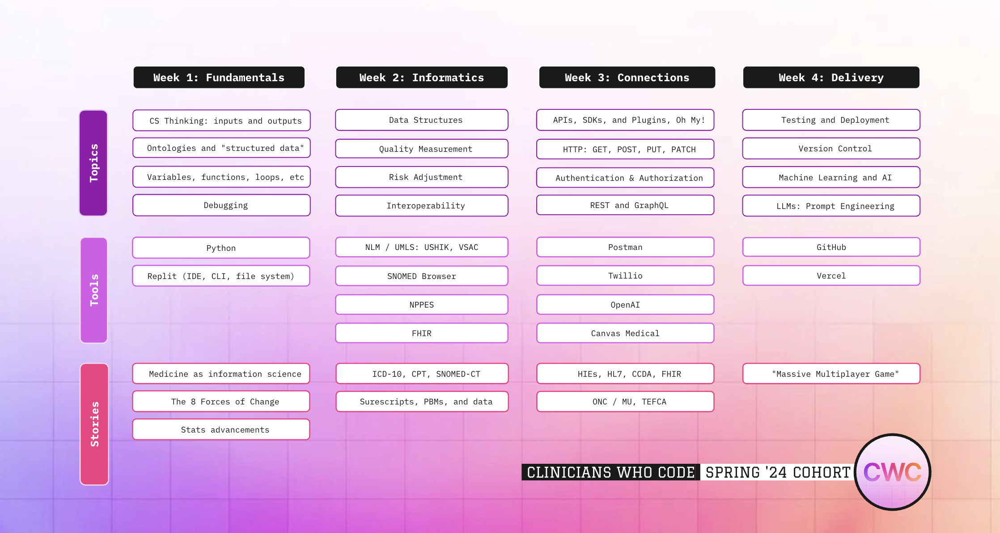

# Clinicians Who Code

## Overview
The Clinicians Who Code (CWC) program is designed to empower clinicians with coding skills, focusing on the intersection of healthcare and technology. This 4-week intensive course covers a broad range of topics from programming fundamentals to advanced healthcare informatics.

## Table of Contents
- [Week 1: Fundamentals](#week-1-fundamentals)
- [Week 2: Informatics](#week-2-informatics)
- [Week 3: Connections](#week-3-connections)
- [Week 4: Delivery](#week-4-delivery)
- [License](#license)

## Week 1: Fundamentals

### Topics
- CS Thinking: Inputs and Outputs
- Ontologies and "Structured Data"
- Variables, Functions, Loops, etc.
- Debugging

### Tools
- Python
- Replit (IDE, CLI, File System)

### Stories
- Medicine as Information Science
- The 8 Forces of Change
- Stats Advancements

## Week 2: Informatics

### Topics
- Data Structures
- Quality Measurement
- Risk Adjustment
- Interoperability

### Tools
- NLM / UMLS: USHIK, VSAC
- SNOMED Browser
- NPPES
- FHIR

### Stories
- ICD-10, CPT, SNOMED-CT
- Surescripts, PBMs, and Data

## Week 3: Connections

### Topics
- APIs, SDKs, and Plugins, Oh My!
- HTTP: GET, POST, PUT, PATCH
- Authentication & Authorization
- REST and GraphQL

### Tools
- Postman
- Twilio
- OpenAI
- Canvas Medical

### Stories
- HIEs, HL7, CCDA, FHIR
- ONC / MU, TEFCA

## Week 4: Delivery

### Topics
- Testing and Deployment
- Version Control
- Machine Learning and AI
- LLMs: Prompt Engineering

### Tools
- GitHub
- Vercel

### Stories
- "Massive Multiplayer Game"

## License
This project is licensed under the MIT License - see the [LICENSE](LICENSE) file for details.

---

**Clinicians Who Code - Spring '24 Cohort**
